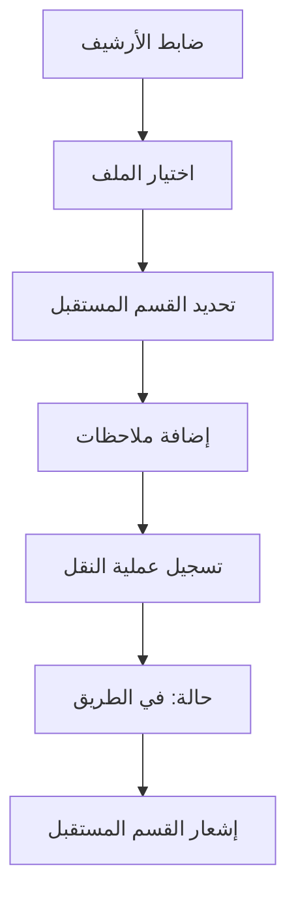
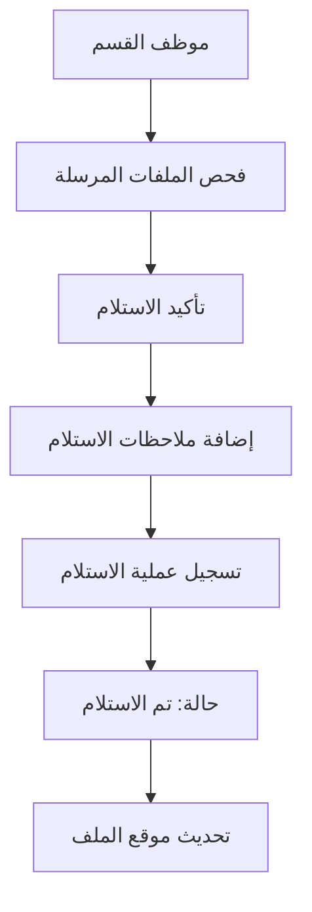

# نظام تتبع حركة الملفات (File Movement Tracking System)

## نظرة عامة

تم إنشاء نظام شامل لتتبع حركة الملفات في نظام الأرشيف، يسمح بمراقبة انتقال الملفات بين الأقسام والإدارات المختلفة مع تسجيل تفصيلي للمستخدمين المسؤولين عن الإخراج والاستلام.

## الميزات الأساسية

### 1. **تتبع شامل للملفات**
- تسجيل كامل لحركة الملفات بين جميع الأقسام
- معرفة الملف انتقل من أي قسم إلى أي قسم
- تسجيل المستخدم الذي أخرج الملف
- تسجيل المستخدم الذي استلم الملف
- التوقيت الدقيق لكل عملية نقل واستلام

### 2. **الحالات المختلفة للملفات**
- **في الأرشيف** (`in_archive`): الملف موجود في الأرشيف الرئيسي
- **تم النقل** (`transferred`): تم إرسال الملف لقسم آخر
- **في الطريق** (`in_transit`): الملف في طريقه للقسم المقصود
- **تم الاستلام** (`received`): تم استلام الملف من القسم المرسل إليه

### 3. **الأقسام المدعومة**
- **الأرشيف** (`archive`): المكان الرئيسي لحفظ الملفات
- **الشؤون القانونية** (`legal`): قسم المراجعة القانونية
- **الحوكمة والامتثال** (`governance`): قسم التدقيق والامتثال
- **إدارة التحصيل** (`collection`): قسم متابعة التحصيل
- **إدارة التوريق** (`securitization`): قسم التوريق والاستثمار

## الصفحات والوظائف

### 1. **صفحة تتبع حركة الملفات** (`file-tracking.html`)

**الوظائف الأساسية**:
- عرض جميع الملفات وحركتها
- تتبع الملفات حسب الرقم أو الاسم
- فلترة حسب القسم أو الحالة
- عرض التاريخ الزمني لكل ملف (Timeline)
- نقل الملفات بين الأقسام
- استلام الملفات المرسلة

**مكونات الواجهة**:
- شريط البحث والفلترة
- قائمة الملفات مع حالاتها الحالية
- نوافذ منبثقة لنقل واستلام الملفات
- عرض التاريخ الزمني التفاعلي

### 2. **صفحة تقارير حركة الملفات** (`movement-reports.html`)

**الوظائف التحليلية**:
- إحصائيات شاملة لحركة الملفات
- رسوم بيانية لنشاط الأقسام
- تقارير قابلة للتصدير
- فلترة حسب التاريخ والقسم
- جدول الحركات الأخيرة

**الإحصائيات المعروضة**:
- إجمالي الحركات
- الحركات المكتملة
- الحركات المعلقة
- عدد الملفات النشطة

### 3. **لوحة إدارة تتبع الملفات** (`file-management-dashboard.html`)

**وظائف الإدارة**:
- لوحة تحكم مركزية
- إحصائيات سريعة
- قائمة الملفات المعلقة
- النشاط الأخير
- النقل المجمع للملفات

**الميزات المتقدمة**:
- نقل عدة ملفات دفعة واحدة
- تحديد الملفات العاجلة (المعلقة أكثر من 7 أيام)
- عرض سريع للحالة العامة

## هيكل قاعدة البيانات

### مجموعة `file_movements`

```javascript
{
  fileNumber: "string",           // رقم الملف
  fileName: "string",             // اسم الملف (اختياري)
  fromDepartment: "string",       // القسم المرسل
  toDepartment: "string",         // القسم المستقبل
  action: "transfer|receive",     // نوع العملية
  status: "in_transit|received",  // حالة الملف
  notes: "string",                // ملاحظات العملية
  userId: "string",               // معرف المستخدم
  userEmail: "string",            // بريد المستخدم
  userDisplayName: "string",      // اسم المستخدم
  timestamp: Timestamp            // وقت العملية
}
```

### تحديث مجموعة `documents`

```javascript
{
  // ...الحقول الموجودة...
  fileNumber: "string",           // رقم الملف للربط
  currentStatus: "string",        // الحالة الحالية
  currentDepartment: "string",    // القسم الحالي
  lastUpdated: Timestamp          // آخر تحديث
}
```

## الصلاحيات والأدوار

### صلاحيات جديدة تم إضافتها:

1. **`track_file_movements`**: تتبع حركة الملفات
2. **`transfer_files`**: نقل الملفات
3. **`receive_files`**: استلام الملفات  
4. **`view_movement_history`**: عرض تاريخ الحركات

### توزيع الصلاحيات حسب الأدوار:

**مدير النظام (Admin)**:
- جميع الصلاحيات
- إدارة شاملة لنظام التتبع
- تقارير متقدمة
- النقل المجمع

**ضابط الأرشيف (Archive Officer)**:
- تتبع حركة الملفات
- نقل واستلام الملفات
- إدارة الأرشيف الرئيسي

**الأدوار الأخرى**:
- عرض الملفات المتعلقة بقسمهم
- استلام الملفات المرسلة إليهم

## سير العمل (Workflow)

### 1. نقل ملف من الأرشيف إلى قسم



### 2. استلام ملف في القسم



## الواجهات التقنية

### Firebase Functions المطلوبة

```javascript
// Function لإرسال إشعارات عند نقل الملفات
exports.onFileTransfer = functions.firestore
  .document('file_movements/{movementId}')
  .onCreate(async (snap, context) => {
    const movement = snap.data();
    if (movement.action === 'transfer') {
      // إرسال إشعار للقسم المستقبل
      await sendNotificationToUsersByDepartment(
        movement.toDepartment,
        `تم إرسال ملف ${movement.fileNumber} إليكم`
      );
    }
  });
```

### Firestore Security Rules

```javascript
// قواعد الأمان لمجموعة file_movements
match /file_movements/{movementId} {
  allow read: if isAuthenticated() && 
    (hasPermission('track_file_movements') ||
     resource.data.toDepartment == getUserDepartment() ||
     resource.data.fromDepartment == getUserDepartment());
     
  allow create: if isAuthenticated() && 
    hasPermission('transfer_files') &&
    request.auth.uid == request.resource.data.userId;
    
  allow update: if isAuthenticated() && 
    hasPermission('receive_files') &&
    request.auth.uid == request.resource.data.userId;
}
```

## التقارير والتحليلات

### 1. تقرير النشاط اليومي
- عدد الملفات المنقولة
- عدد الملفات المستلمة  
- أكثر الأقسام نشاطاً
- الملفات المعلقة

### 2. تقرير الأداء الشهري
- متوسط وقت النقل بين الأقسام
- معدل استلام الملفات
- الملفات المتأخرة
- كفاءة الأقسام

### 3. تقرير التدقيق
- سجل كامل لحركة كل ملف
- المستخدمين المسؤولين عن كل عملية
- التوقيتات الدقيقة
- المخالفات (إن وجدت)

## الأمان والتدقيق

### 1. تسجيل العمليات
- كل عملية نقل أو استلام مسجلة
- معرف المستخدم والوقت
- عدم إمكانية الحذف أو التعديل

### 2. صلاحيات محددة
- كل مستخدم يرى فقط ما يخص قسمه
- عمليات النقل تتطلب صلاحيات خاصة
- المدراء لهم رؤية شاملة

### 3. التحقق من صحة البيانات
- التأكد من وجود الملف قبل النقل
- منع النقل للقسم نفسه
- التحقق من صلاحيات المستخدم

## التطوير المستقبلي

### المرحلة الثانية
- [ ] إشعارات تلقائية عبر البريد الإلكتروني
- [ ] تكامل مع نظام الباركود
- [ ] تطبيق الهاتف المحمول
- [ ] تتبع الموقع الجغرافي للملفات

### المرحلة الثالثة  
- [ ] ذكاء اصطناعي لتحليل أنماط الحركة
- [ ] توقع احتياجات الأقسام
- [ ] أتمتة بعض عمليات النقل
- [ ] تكامل مع أنظمة خارجية

## المتطلبات التقنية

### متطلبات الخادم
- Firebase Firestore للتخزين
- Firebase Functions للمعالجة
- Firebase Auth للمصادقة
- Firebase Storage للمرفقات

### متطلبات المتصفح
- دعم JavaScript ES6+
- دعم CSS Grid و Flexbox
- LocalStorage للتخزين المؤقت
- WebRTC للكاميرا (للباركود)

### الأدوات المساعدة
- Bootstrap 5.3.0 RTL للواجهات
- Font Awesome للأيقونات
- Chart.js للرسوم البيانية (مستقبلي)
- PDF.js لعرض الملفات (مستقبلي)

## التوثيق التقني

### API Reference

#### إنشاء حركة جديدة
```javascript
await db.collection('file_movements').add({
  fileNumber: "F2024001",
  fileName: "عقد التأسيس",
  fromDepartment: "archive",
  toDepartment: "legal",
  action: "transfer",
  status: "in_transit",
  notes: "للمراجعة القانونية",
  userId: currentUser.uid,
  userEmail: currentUser.email,
  userDisplayName: currentUser.displayName,
  timestamp: firebase.firestore.FieldValue.serverTimestamp()
});
```

#### الاستعلام عن حركات ملف
```javascript
const movements = await db.collection('file_movements')
  .where('fileNumber', '==', fileNumber)
  .orderBy('timestamp', 'desc')
  .get();
```

#### تحديث حالة الملف
```javascript
await updateFileStatus(fileNumber, 'received', targetDepartment);
```

---

**تم إنشاؤه بواسطة**: نظام الأرشيف - تتبع حركة الملفات  
**التاريخ**: ديسمبر 2024  
**الإصدار**: 1.0  
**المطور**: فريق تطوير نظام الأرشيف
