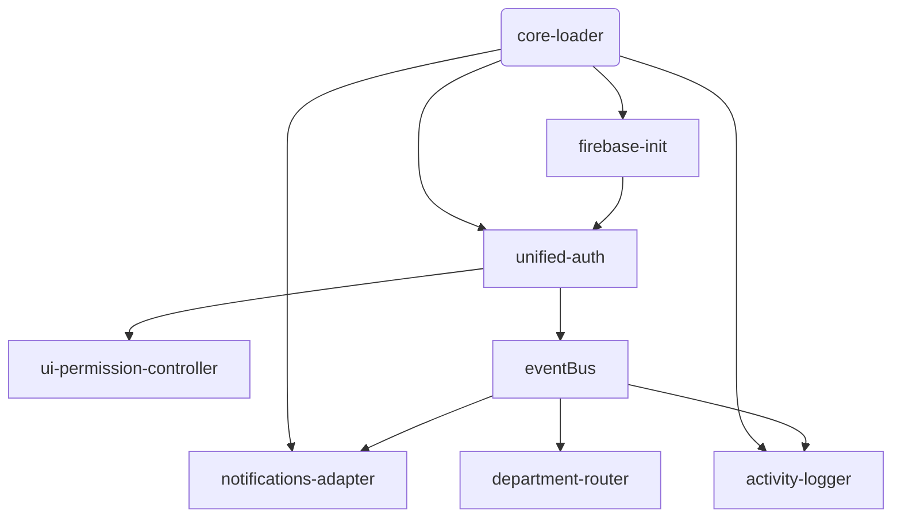

# تقرير مبدئي لتدقيق واجهة المستخدم (Frontend UI Audit)

تاريخ الإنشاء: 2025-08-20

## 1. الهدف
هذا التقرير يقدّم رؤية أولية منظمة لحالة طبقة الواجهة الحالية بهدف:
1. تقليل زمن التحميل (Initial / FCP / TTI)
2. إزالة التكرار والتضارب بين الأنظمة (Auth, Notifications, Permissions)
3. توحيد نمط التهيئة (Boot Sequence) وبناء إطار تحميل كسول (Lazy Loading)
4. التحضير للانتقال إلى ES Modules + Bundler (Vite / ESBuild)
5. تعزيز الأمان (تقليل السطح المكشوف على `window` + إعداد CSP مستقبلاً)

## 2. وضع التحميل الحالي (Index.html نموذجاً)
- أكثر من 30 `<script>` (قبل التعديل) → ارتفاع وقت التحليل (Parse/Compile)
- تكرار تحميل بعض السكربتات: `activity-logger.js`, `notifications.js` (كانت محمّلة مرتين – عولج جزئياً)
- خلط بين سكربتات ضرورية للعرض الأول (Critical) وأخرى ثانوية (Non-Critical)
- عدم وجود ترتيب مُعلن للتبعيات (Implicit Dependency Chain) → صعوبة الصيانة / أخطاء سباق (Race Conditions)

### تصنيف أولي للسكريبتات حسب الأهمية
| الفئة | الملفات | ملاحظات |
|-------|---------|---------|
| Critical (Auth + Firebase) | `firebase-config.js`, `firebase-init.js`, `unified-auth.js` | يجب أن تُحمّل مبكراً ولكن بشكل مؤجل (defer) |
| Permissions / UI State | `ui-permission-controller.js`, `roles.js`, `page-access-control.js` | تعتمد على Auth جاهز |
| Navigation / Layout | `sidebar.js`, `navigation-setup.js`, `department-router.js` | يمكن تأجيلها لما بعد تفاعل أول |
| Notifications Stack | `notifications.js`, `notification-service.js`, `notification-badge.js`, `smart-notifications.js`, `advanced-alerts.js`, `notification-integration.js` | يمكن دمجها في حزمة واحدة + تحميل مشروط عند أول استخدام |
| Data / Integration | `cloud-services.js`, `data-manager.js`, `dataconnect-sdk.js`, `dataconnect-integration.js` | Data Connect غير حرجة للعرض الأول |
| Optional / Diagnostics | `performance-tester.js`, `final-integration-test.js`, `auto-test-reporter.js`, `emergency-fix.js`, `migration-helper.js` | تُفصل لاحقاً عن حزمة الإنتاج |
| Feature Modules | `barcode-scanner.js`, `file-management-dashboard.js`, `qrcode-local.js` | مرشح قوي للتحميل الديناميكي عند الدخول للصفحة الخاصة |

## 3. مشاكل محددة تم رصدها
| المشكلة | الأثر | الحالة |
|---------|------|--------|
| تكرار تحميل بعض السكربتات | هدر وقت + مخاطر تهيئة مزدوجة | تم تقليلها في `index.html` (خطوة 1) |
| اعتماد واسع على Globals (`window.*`) | تشويش مساحة الأسماء + صعوبة الاختبار | قيد المعالجة (يتطلب نمط Module Wrapper) |
| غياب مخطط تبعيات رسمي | أخطاء زمن التهيئة المحتملة | مقترح إنشاء `manifest.json` داخلي |
| لا يوجد Bundling | زمن تحميل مرتفع (Network Waterfall) | ضمن خارطة الطريق |
| لا يوجد Code Splitting | تحميل كود غير مستخدم مبكراً | ضمن خارطة الطريق |
| الأنظمة المتداخلة للإشعارات | تعقيد زائد | دمج API موحد مقترح |
| عدم وجود قياسات فعلية للأداء (LCP/FID) | صعوبة التتبع | سيتم ربط `performance-tester.js` بـ `reporting endpoint` محلي |
| لا يوجد حارس تكرار تحميل (Idempotent Init) في كل الوحدات | مخاطر تهيئة مكررة | إضافة نمط حارس قياسي (initOnce) مقترح |

## 4. خريطة تبعية مبسطة (مستخلصة بالتحليل اليدوي)
```
firebase-init -> unified-auth -> ui-permission-controller
unified-auth -> (auth events) -> notification-service / activity-logger / department-router
notifications.js (الحاوية الأساسية) <- smart-notifications / advanced-alerts / notification-integration
script-loader.js (قابل للاستبدال) -> (dynamic load attempt for: notifications, analytics, data-manager, sidebar)
```

## 5. إستراتيجية التحسين المقترحة (3 مراحل)
### مرحلة 1 (سريعة – 1-2 أيام)
1. توثيق تبعيات رسمية في `public/assets/js/module-manifest.json`
2. إضافة حارس تهيئة موحد لكل Module: `if(window.__<name>Loaded) return; window.__<name>Loaded=true;`
3. إزالة أي سكربتات مكررة متبقية في الصفحات العليا (Index, Dashboard)
4. إضافة `defer` لكل السكربتات غير الحرجة + نقل الحرج فقط لنهاية `<body>`
5. قياس الأداء قبل/بعد (Timing API + console table)

### مرحلة 2 (بناء أسس) – 3-4 أيام
1. إنشاء Loader موحد: `core-loader.js` يتعامل مع (manifest + dependency resolution + dynamic import)
2. تحويل 3 وحدات إلى نمط Module IIFE تُعيد كائن مُسجّل بـ Registry
3. دمج طبقة الإشعارات في واجهة موحدة: `notify.{info|success|warn|error}` + Adapter داخلي
4. إضافة قناة أحداث (`eventBus`) خفيفة: Pub/Sub بسيط لتقليل الارتباط المباشر
5. إدخال فحص صحة ذاتي (Self Integrity Check) يُسجل اختلاف النسخ (Version Drift)

### مرحلة 3 (تحسين عميق) – 1 أسبوع
1. إدماج Bundler (Vite أو ESBuild):
   - مدخل رئيسي: `src/frontend/main.ts`
   - تقسيم حزم: `auth`, `notifications`, `scanner`, `dashboard`
2. تفعيل Code Splitting + Dynamic Import في الصفحات الثانوية
3. توليد `preload hints` تلقائية ( `<link rel="modulepreload">` ) للحزم الحرجة
4. تطبيق CSP (Content-Security-Policy) مع إزالة الـ inline scripts (نقلها إلى ملفات)
5. إعداد اختبارات واجهة مبدئية (Jest DOM / Playwright لاحقاً) لصفحتين أساسيتين

## 6. مقاييس الأداء المستهدفة (KPIs)
| المقياس | الوضع الحالي (تقديري) | الهدف مرحلة 1 | الهدف مرحلة 3 |
|---------|------------------------|---------------|---------------|
| Requests (initial index) | > 35 | < 22 | < 10 (bundled) |
| Total JS KB (transfer) | ~ (غير مقاس) | -15% | -40% |
| First Contentful Paint | غير مقاس | < 2.5s | < 1.8s |
| Time To Interactive | غير مقاس | < 4.5s | < 2.5s |

سيتم تثبيت سكريبت قياس بسيط لإرسال نتائج إلى `console.table` مبدئياً.

## 7. المخاطر & الضوابط
| الخطر | التخفيف |
|-------|---------|
| كسر وظائف حالية أثناء إعادة التنظيم | تنفيذ مراحل صغيرة + حفظ نسخة قبل كل دفعة |
| اختلاف توقيت الأحداث (Race Conditions) | إدخال Event Bus + توحيد ready events |
| صعوبة تتبع الأعطال بعد الدمج | إضافة `window.__MODULE_REGISTRY__` مع حالة كل وحدة |
| تضارب بين النسخ القديمة في متصفح المستخدم (Cache) | إضافة Hash للأصول أو تفعيل `firebase.json` headers (cache-control + version query) |

## 8. التغييرات المنفذة حتى الآن (هذه الدورة)
- تعديل `index.html`:
  - إزالة تكرارات تحميل (`activity-logger.js`, `notifications.js` مكررة سابقاً)
  - إضافة `defer` للسكريبتات غير الحرجة.
  - إعادة ترتيب (Auth → Permissions → Notifications → Navigation → DataConnect)
  - توضيح تعليق مرحلي للتحول المستقبلي إلى Bundler.

## 9. خطة التنفيذ التفصيلية (الدفعة التالية)
1. إنشاء `public/assets/js/module-manifest.json`
2. إنشاء `core-loader.js` (قراءة المانيفست + تحميل متسلسل + تسجيل زمن كل وحدة)
3. نقل الـ inline script في `index.html` إلى ملف `index-bootstrap.js` (لتسهيل CSP)
4. إضافة أداة قياس بسيطة `performance-metrics.js`
5. توحيد نقطة الدخول للإشعارات (`notify` موجود - نبدأ بإنشاء Adapter يوحد مصادر الإشعار)

## 10. قرارات معمارية مبدئية (Proposed Architecture Notes)


## 11. ملاحظات ختامية
هذا التدقيق أولي وسيُحدّث بعد إدخال المانيفست وقياس الأرقام الفعلية. التركيز القادم: تثبيت بنية التحميل، تقليل الاعتماد على الترتيب الضمني، ثم الانتقال التدريجي إلى Bundler دون تعطيل البيئة الحالية.

---
تم إعداد التقرير آلياً كجزء من مرحلة الانتقال إلى محور واجهة المستخدم.
